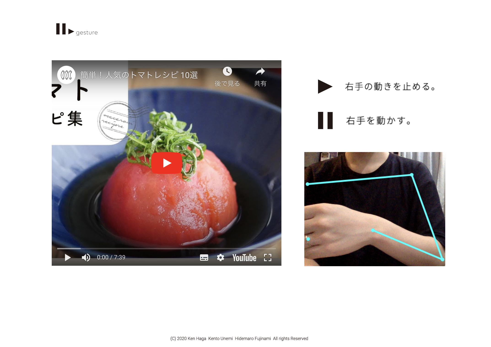
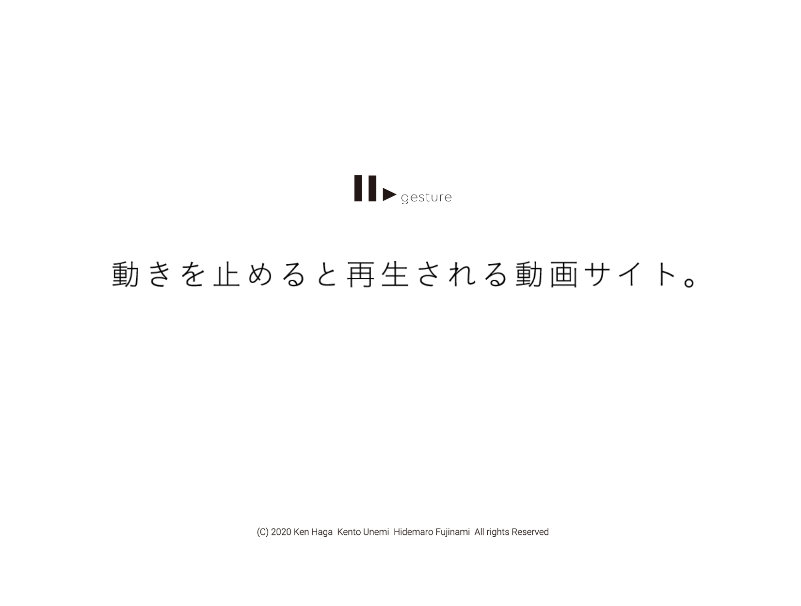

# motion_youtube

Play/Stop youtube video with your motion.

## library
- Nuxt.js
- tensorflow.js
- VueYoutube

## functions 
- Play/Stop youtube video with your motion

- youtube video search (might not working. need to set API key)

## screenshots

